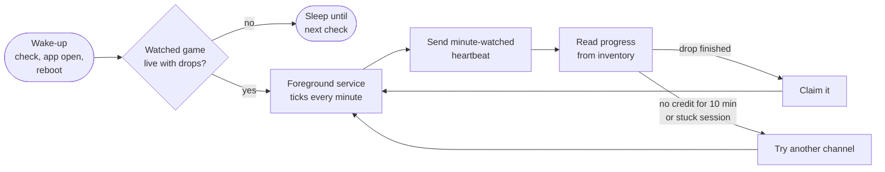

<div align="center">


# PocketDrop

**Earn Twitch drops in your pocket.**<br>
PocketDrop watches for your games, earns their drops in the background and claims them for you.
It never plays any video.

[](https://github.com/Reiss-Cashmore/pocketdrop/actions/workflows/build.yml)


</div>

<!-- Screenshots: docs/screenshots/{home,campaign,games,rewards,settings}.png
<p align="center">
  
  
  
  
  
</p>
-->

## Why

Twitch drops reward you for watching streams, but only while a player is open. PocketDrop
sends Twitch the same small "a minute was watched" signal its web player sends, without
downloading any video. It can run all night on a locked phone.

## Features

| | |
|---|---|
| 🎮 **Your games first** | Pick games from a searchable box-art grid of every active campaign. They're mined in your order, even before you've started their campaign. |
| ⚡ **Auto mine** | Starts by itself when a watched game goes live: on a background check every 30 min to 2 h, when you open the app, after a reboot and after an update. |
| 🎁 **Claims for you** | Finished drops are claimed within a minute, and they show up on the Rewards tab with their images. |
| 📈 **Uptime you can see** | A minute-by-minute chart of what each minute achieved (credited, sent, failed, idle) over 1 h, 6 h or 24 h. |
| 🔍 **Campaign details** | Tap any campaign to see every drop and its reward, time left, which channels count, and a link to connect your game account when Twitch needs one. |
| 🧠 **Smart channel choice** | Honours channel allow-lists, skips campaigns whose game account isn't linked, and leaves a channel quickly when Twitch is stuck counting something else. |
| 🔋 **Your rules** | Mine only while charging or only on Wi‑Fi. Optionally watch two games at once (experimental). |
| 🌗 **Looks at home** | Material 3 in a violet theme, with light, dark or system mode and optional wallpaper colours. The layout adapts to foldables and tablets. |
| 🔒 **Private by design** | Signs in through Twitch's own page and keeps its tokens encrypted with a hardware-backed Android Keystore key. No analytics, no servers of its own. |
| 🩺 **Honest diagnostics** | A shareable report with everything the miner did and why. It contains no tokens. |

## How it works



- **Sign-in.** An in-app WebView shows Twitch's normal login page, and PocketDrop keeps the
  resulting web session.
- **Unlocking the campaign list.** Since September 2026 Twitch hides the campaign list
  behind a *Client-Integrity* token. PocketDrop gets one from an invisible WebView running
  Twitch's own anti-bot script, and renews it on its own whenever it runs out.
- **Mining.** A foreground service with a partial wake lock ticks once a minute. Each tick
  sends one heartbeat per channel to Twitch's analytics endpoint, as the web player does,
  then reads progress back from the inventory.
- **Claiming.** Finished drops are claimed with the same request the Twitch drops page uses.

The approach follows [DropForge](https://github.com/HimanM/DropForge) and
[TwitchDropsMiner](https://github.com/DevilXD/TwitchDropsMiner). On a desktop they drive
Chrome; here an Android WebView plays that role.

## Install

1. Open **[Actions → Build APK](https://github.com/Reiss-Cashmore/pocketdrop/actions/workflows/build.yml)**,
   pick the newest green run, and download **PocketDrop-apk** under *Artifacts*.
2. Unzip it and open the APK on your phone. Allow installing from your browser or file
   manager if Android asks.

Updates install over the top as long as every build is signed with the same key (see
[Signing](#signing)).

### First run
1. **Sign in with Twitch.** The page is Twitch's own, and PocketDrop never sees your password.
2. **Home → Finish setting up.** Allow notifications and background use. Without them
   Android pauses mining when the screen is off.
3. **Games → Add.** Choose your games and put the most important one on top.
4. Tap **Start mining**, or just leave it: Auto mine starts on its own when a watched game
   goes live.

> **GrapheneOS:** works as is. Nothing needs Google Play Services, and Vanadium's WebView
> handles sign-in and the integrity token.

## Settings at a glance

| Where | Setting | Default |
|---|---|---|
| Games | Only mine these games | Off: in-progress drops are mined after your list |
| Games | Auto mine | **On** |
| Games | Background check | 30 min when Auto mine is turned on (30 min, 1 h, 2 h or off) |
| Settings → Mining | Only while charging | Off |
| Settings → Mining | Only on Wi‑Fi | Off |
| Settings → Mining | Watch two channels (experimental) | Off |
| Settings → Appearance | Theme · wallpaper colours | System · off |

## Battery and data

PocketDrop streams no video. Each minute it makes a few small web requests: the heartbeat,
a progress read, and now and then a channel lookup. The partial wake lock keeps only the
CPU awake. The screen stays off, and the service lets the phone sleep between ticks.

When nothing is live and a background check is on, mining stops after 10 idle minutes and
the next check starts it again.

## Privacy and security

- **Where your tokens go.** Your Twitch session and integrity tokens are encrypted with an
  AES‑256 key held in the Android Keystore, and they never leave the phone except in requests
  to Twitch.
- **No extra services.** There are no analytics, no crash reporting and no servers of its
  own. It talks only to Twitch and Twitch's image CDN.
- **What the report contains.** The diagnostics report says whether each token exists and
  when it expires, never the token itself.
- **Build hardening.** WebView remote debugging is off in release builds, and app backups
  are disabled.
- **Proof of origin.** Settings → Security shows whether your build is signed with your own
  private key.

## Troubleshooting

| Symptom | Try |
|---|---|
| Uptime chart shows red "missed" minutes | Allow background use. On GrapheneOS: Settings → Apps → PocketDrop → Battery → Unrestricted. |
| A watched game never starts | Open its campaign. **Not linked** means Twitch needs your game account connected first. |
| "Sent, not yet credited" for a long time | Normal for a few minutes, because Twitch credits in bursts. After 10 minutes PocketDrop moves to another channel. |
| Anything else | Settings → Diagnostics → **Share full report**, and attach it to an issue. |

## Building

The [workflow](.github/workflows/build.yml) builds a release APK on every push to `main`.
To build locally, open the project in Android Studio or run `./gradlew assembleRelease`.

**Stack:** Kotlin 2.4 on AGP 9 and Gradle 9, Jetpack Compose with Material 3 (adaptive
navigation), WorkManager, OkHttp 5 and Coil 3. Minimum Android 10, targeting Android 17
(API 37). Versions live in [`gradle/libs.versions.toml`](gradle/libs.versions.toml), and
Dependabot proposes updates weekly.

### Signing

Until you add a private key, builds are signed with the public throwaway key in `keystore/`.
Anyone could sign an "update" with that key. To use your own:

1. Create a key on any machine with Java:
   `keytool -genkeypair -v -keystore pocketdrop.jks -alias pocketdrop -keyalg RSA -keysize 4096 -validity 10000`
2. Base64-encode it: `base64 -w0 pocketdrop.jks > pocketdrop.jks.b64` (macOS: `base64 -i pocketdrop.jks`).
3. In the repo, go to **Settings → Secrets and variables → Actions** and add:
   - `SIGNING_KEYSTORE_B64`: the base64 text
   - `SIGNING_STORE_PASSWORD`
   - `SIGNING_KEY_ALIAS`: `pocketdrop`
   - `SIGNING_KEY_PASSWORD`: the same as the store password unless you chose another
4. Re-run the build. Android refuses an update signed with a different key, so uninstall the
   old PocketDrop once (you'll need to sign in to Twitch again) and then install the new APK.
   Keep `pocketdrop.jks` and its password safe, because every future update needs them.

### Project layout

```
app/src/main/java/dev/dropspike/
  twitch/    TwitchApi (GraphQL, heartbeats, claims), IntegrityMinter (Kasada in a WebView),
             GameCatalog
  service/   Miner (channel choice, credit checks), MinerService (foreground service),
             WakeWorker + AutoMine (background checks, reboot/update)
  data/      Prefs, SecureStore (Keystore), UptimeLog, ClaimLog, DiagLog, ReportBuilder
  ui/        Compose screens: Home, Games, Rewards, Settings, the campaign sheet, onboarding,
             and Motion (shared animation and haptics)
art/         pocketdrop.svg and the script that generates the app icons from it
docs/        spike-notes.md: how the first build proved the approach
```

## Credits

- **Integrity flow and GraphQL operations:** derived from
  [DropForge](https://github.com/HimanM/DropForge) (MIT, © 2026 HimanM, © 2024 DevilXD) and
  [Streamlink](https://github.com/streamlink/streamlink) (BSD‑2‑Clause).
- **Icons:** Material Icons (Apache 2.0).

## Disclaimer

PocketDrop is not affiliated with or endorsed by Twitch. Automating drops may break Twitch's
terms of service, so use it at your own risk.
